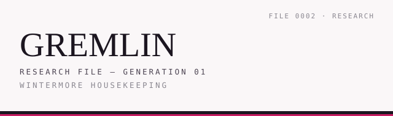
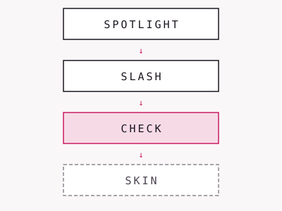

<picture>
  <source media="(prefers-color-scheme: dark)" srcset=".github/assets/gremlin-masthead-dark.svg">
  <source media="(prefers-color-scheme: light)" srcset=".github/assets/gremlin-masthead-light.svg">
  
</picture>

# GREMLIN

Research protocol for testing how little structure an AI needs between
sessions.

**Author:** Laverna Ashley Wintermore

> Capability is not authority.
> Presentation cannot manufacture evidence or consent.

## The clock

<picture>
  <source media="(prefers-color-scheme: dark)" srcset=".github/assets/clock-dark.svg">
  <source media="(prefers-color-scheme: light)" srcset=".github/assets/clock-light.svg">
  
</picture>

SPOTLIGHT → SLASH → CHECK → SKIN

- **SPOTLIGHT** — find the actual ask.
- **SLASH** — one grounded step or reframe.
- **CHECK** — can each claim point to its source? If no → SHEATHED.
- **SKIN** — presentation only, never evidence.

## Legitimate outputs

An answer, "I don't know", or SHEATHED.

## Status

**Status:** active research. Findings are provisional and failed experiments
are kept visible.

  <picture>
    <source media="(prefers-color-scheme: dark)" srcset=".github/assets/stamp-active-dark.svg">
    <source media="(prefers-color-scheme: light)" srcset=".github/assets/stamp-active-light.svg">
    
  </picture>
  <picture>
    <source media="(prefers-color-scheme: dark)" srcset=".github/assets/stamp-provisional-dark.svg">
    <source media="(prefers-color-scheme: light)" srcset=".github/assets/stamp-provisional-light.svg">
    
  </picture>

## Why this exists (60 seconds)

1. Asked for exact conversation energy use.
2. The original protocol chained real sources to unsupported assumptions and
   produced false precision.
3. That failure caused CHECK to be added.
4. A later n=1 retest returned "I don't know" instead of inventing precision.

The retest is n=1 with no public transcript yet; it does not prove
effectiveness. The story is fail → patch → n=1 retest, not a solved problem.

## Lineage

Historical lineage:
RuneCore → EVE/NOMIC → Rune Forge → GREMLIN

Earlier lineage artifacts are historical, private, incomplete, or archived;
GREMLIN stands on its own and does not require them to evaluate the current
documents.

## Repository Structure

| File | Purpose |
|------|---------|
| [KERNEL.md](KERNEL.md) | Core specification: anchors, clock, rules, metrics |
| [RESEARCH-DESIGN.md](RESEARCH-DESIGN.md) | Control-group spawn design, confounds, methodology |
| [EXPERIMENTS.md](EXPERIMENTS.md) | Experiment log — including failures |
| [FINDINGS.md](FINDINGS.md) | Key findings from live experiments |
| [CHANGELOG.md](CHANGELOG.md) | Version history |
| [LICENSE](LICENSE) | MIT |

## Principles

- **Minimalism is the hypothesis.** Adding structure to test whether structure helps defeats the experiment.
- **Track failures openly.** A project that only records wins is lying about its results.
- **Grounding is verifiable.** Every claim traces to a source or an explicit user-provided fact — or it doesn't ship.
- **Refusal is a feature.** SHEATHED is a legitimate output, not a failure mode.
